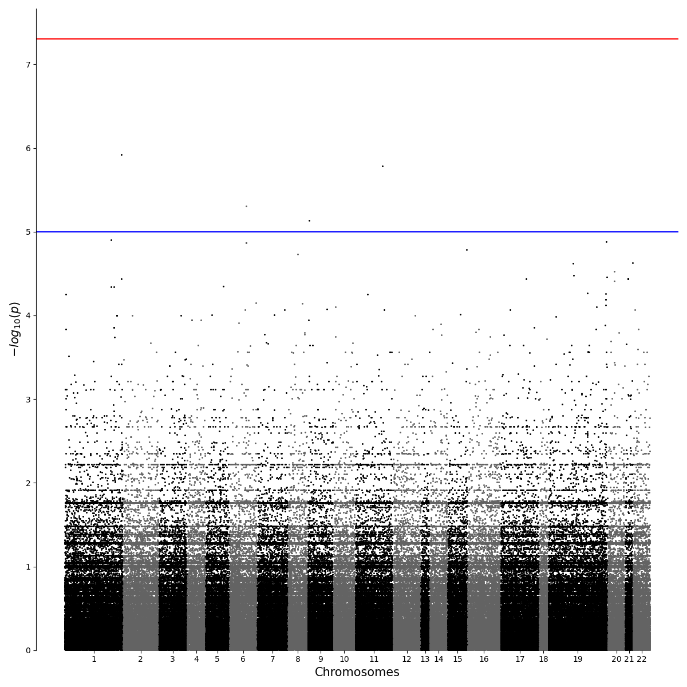
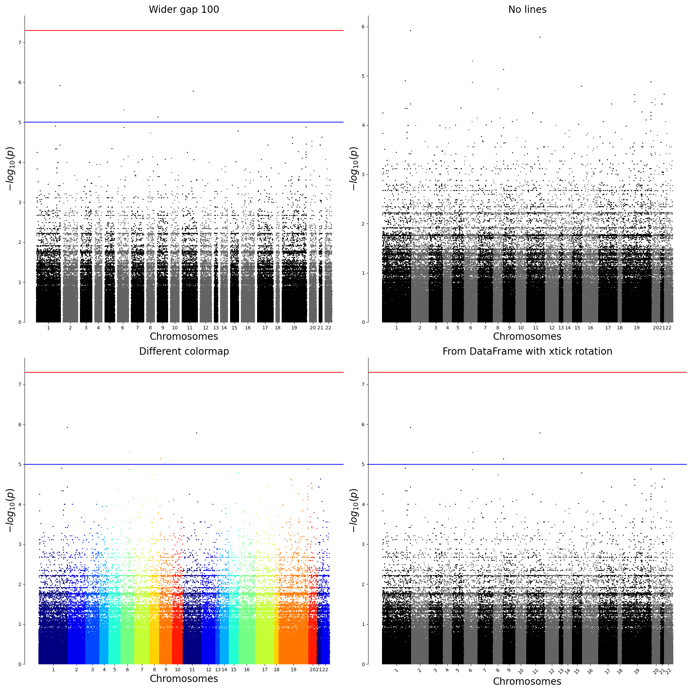
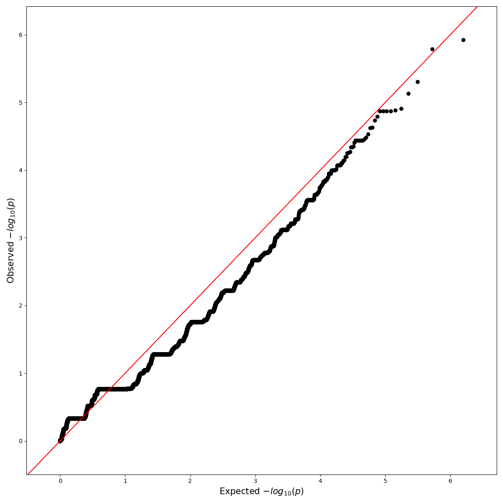
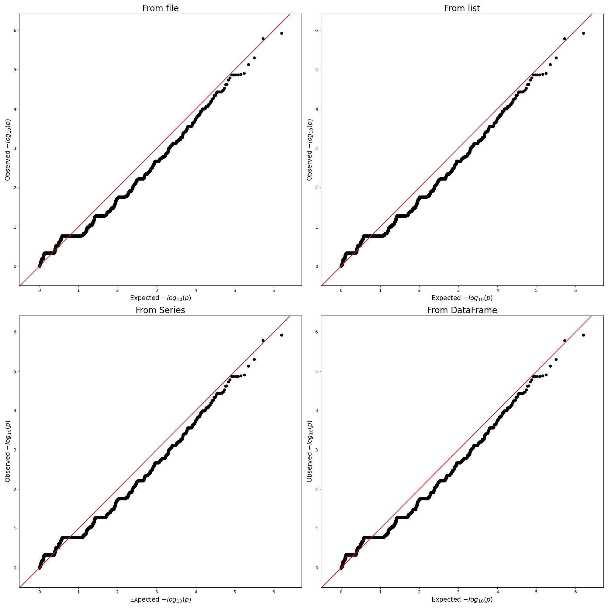

<h1 style="text-align:center">qqman</h1>


If you want to check out the source code or have any issues please leave a comment at my [github](https://github.com/satchellhong/qqman) repository. <br>
This library is inspired by r-qqman (see [here](https://github.com/stephenturner/qqman)). <br>
It also contains/will contain other methods for python users.<br>

---
## Contents
1. [Introduction](#h1)<br>
1.1. [Installation](#h11)<br>
1.2. [Features](#h12)<br>
2. [Manhattan Plot](#h2)<br>
2.1. [Parameters](#h21)<br>
2.2. [Examples](#h22)<br>
3. [QQ Plot](#h3)<br>
3.1. [Parameters](#h31)<br>
3.2. [Examples](#h32)<br>
---

## <a name="h1">1. Introduction</a>
### <a name="h11">1.1. Installation</a>
#### Using pip
```console
$ pip install qqman
```

### <a name="h12">1.2. Features</a>
1. [Manhattan Plot](#h2)<br>
2. [QQ Plot](#h3)<br>

## <a name="h2">2. Manhattan Plot</a>

Draws Manhattan plot from PLINK --assoc output or any assoc formatted data that contains [chromosome/basepair/p-value] as columns.

### <a name="h21">2.1. Parameters</a>
<table style="border-collapse: collapse; border: none; text-align: left;">
<tr>
<th>
<code>assoc</code> : string or pandas.DataFrame
</th>
<th>
- Input file path and name of the Plink assoc output.<br>
- Pandas DataFrame with columns [chromosome/basepair/p-value]
</th>
</tr>
<tr>
<th><code>out</code> : string<br>( optional )</th>
<th>Output path and file name of the plot. (ie. out="./Manhattan.png")</th>
</tr>
<tr>
<th><code>cmap</code> : Colormap<br>( optional : default=Greys_r )</th>
<th>A Colormap instance or registered colormap name. matplotlib.cm.get_cmap()</th>
</tr>
<tr>
<th><code>cmap_var</code> : int or list<br>( optional : default=2 )</th>
<th>int : Number of colors to use<br>list : Specific colors to use in colormap</th>
</tr>
<tr>
<th><code>show</code> : bool<br>( optional )</th>
<th>If true, the plot will be shown on your screen. (This option doesn't work in CUI environment.)</th>
</tr>
<tr>
<th><code>gap</code> : float<br>( optional : default=10)</th>
<th>A size of gaps between the group of scatter markers of each chromosome in Manhattan plot</th>
</tr>
<tr>
<th><code>ax</code> : subplot<br>( optional )</th>
<th>If given, this subplot is used to plot in instead of a new figure being created.</th>
</tr>
<tr>
<th><code>title</code> : string<br>( optional )</th>
<th>A title of the plot.</th>
</tr>
<tr>
<th><code>title_size</code> : int<br>( optional )</th>
<th>A size of the title of the plot.</th>
</tr>
<tr>
<th><code>label_size</code> : int<br>( optional )</th>
<th>A size of x and y labels of the plot.</th>
</tr>
<tr>
<th><code>xtick_size</code> : int<br>( optional )</th>
<th>A size of xtick labels.</th>
</tr>
<tr>
<th><code>ytick_size</code> : int<br>( optional )</th>
<th>A size of ytick labels.</th>
</tr>
<tr>
<th><code>xrotation</code> : float<br>( optional )</th>
<th>A rotation degree of xtick labels.</th>
</tr>
<tr>
<th><code>yrotation</code> : float<br>( optional )</th>
<th>A rotation degree of ytick labels.</th>
</tr>
<tr>
<th><code>col_chr</code> : string<br>( optional : default="CHR" )</th>
<th>A string denoting the column name for the chromosome. Defaults to PLINK’s "CHR" Said column must be numeric.<br>
 If you have X, Y, or MT chromosomes, be sure to renumber these 23, 24, 25, etc.
</th>
</tr>
<tr>
<th><code>col_bp</code> : string<br>( optional : default="BP" )</th>
<th>A string denoting the column name for the chromosomal position. Defaults to PLINK’s "BP" Said column must be numeric.</th>
</tr>
<tr>
<th><code>col_p</code> : string<br>( optional : default="P" )</th>
<th>A string denoting the column name for the p-value. Defaults to PLINK’s "P" Said column must be numeric.</th>
</tr>
<tr>
<th><code>col_snp</code> : string<br>( optional : default="SNP" )</th>
<th>A string denoting the column name for the SNP name (rs number). Defaults to PLINK’s "SNP" Said column should be a character</th>
</tr>
<tr>
<th><code>suggestiveline</code> : string<br>( optional : default=-log_10(1e-5) )</th>
<th>Where to draw a "suggestive" line. Set to False to disable.</th>
</tr>
<tr>
<th><code>genomewideline</code> : string<br>( optional : default=-log_10(5e-8) )</th>
<th>Where to draw a "genome-wide sigificant" line. Set to False to disable.</th>
</tr>
</table>

### <a name="h22">2.2. Examples</a>

#### 2.2.1. Simple
```python
from qqman import qqman

if __name__ == "__main__":
	qqman.manhattan("../../temp.assoc",out="./Manhattan.png")
```


#### 2.2.2. Using Subplot
```python
from qqman import qqman
import pandas as pd
import matplotlib.pyplot as plt

if __name__ == "__main__":
	df_assoc = pd.read_csv("../../temp.assoc", header=0, delim_whitespace=True)

	figure, axes = plt.subplots(nrows=2, ncols=2, figsize = (20,20))

	qqman.manhattan("../../temp.assoc", ax=axes[0,0],title="Wider gap 100", gap=100)
	qqman.manhattan("../../temp.assoc", ax=axes[0,1],title="No lines",suggestiveline=False, genomewideline=False)
	qqman.manhattan("../../temp.assoc", ax=axes[1,0],title="Different colormap",cmap=plt.get_cmap("jet"),cmap_var=10)
	qqman.manhattan(df_assoc, ax=axes[1,1],title="From DataFrame with xtick rotation",xrotation=45)

	figure.tight_layout()
	plt.savefig("./manhattan.png",format="png")
	plt.clf()
	plt.close()
```


## <a name="h3">3. QQ Plot</a>

Draws a quantile-quantile plot from p-values of GWAS.

### <a name="h31">3.1. Parameters</a>

<table style="border-collapse: collapse; border: none; text-align: left;">
<tr>
<th>
<code>assoc</code><br>
types: [string, pandas.DataFrame, numpy.array, list]
</th>
<th>
- Input file path and name of the Plink assoc output.<br>
- Pandas DataFrame with columns [chromosome/basepair/p-value]
</th>
</tr>
<tr>
<th><code>out</code> : string<br>( optional )</th>
<th>Output path and file name of the plot. (ie. out="./Manhattan.png")</th>
</tr>
<tr>
<th><code>show</code> : bool<br>( optional )</th>
<th>If true, the plot will be shown on your screen. (This option doesn't work in CUI environment.)</th>
</tr>
<tr>
<th><code>ax</code> : subplot<br>( optional )</th>
<th>If given, this subplot is used to plot in instead of a new figure being created.</th>
</tr>
<tr>
<th><code>title</code> : string<br>( optional )</th>
<th>A title of the plot.</th>
</tr>
<tr>
<th><code>title_size</code> : int<br>( optional )</th>
<th>A size of the title of the plot.</th>
</tr>
<tr>
<th><code>label_size</code> : int<br>( optional )</th>
<th>A size of x and y labels of the plot.</th>
</tr>
<tr>
<th><code>xtick_size</code> : int<br>( optional )</th>
<th>A size of xtick labels.</th>
</tr>
<tr>
<th><code>ytick_size</code> : int<br>( optional )</th>
<th>A size of ytick labels.</th>
</tr>
<tr>
<th><code>xrotation</code> : float<br>( optional )</th>
<th>A rotation degree of xtick labels.</th>
</tr>
<tr>
<th><code>yrotation</code> : float<br>( optional )</th>
<th>A rotation degree of ytick labels.</th>
</tr>
<tr>
<th><code>col_p</code> : string<br>( optional : default="P" )</th>
<th>A string denoting the column name for the p-value. Defaults to PLINK’s "P" Said column must be numeric.</th>
</tr>
</table>

### <a name="h32">3.2. Examples</a>

#### 3.2.1. Simple
```python
from qqman import qqman

if __name__ == "__main__":
	qqman.qqplot("../../temp.assoc",out="./QQplot.png")
```


#### 3.2.2. Using Subplot
```python
from qqman import qqman
import pandas as pd
import matplotlib.pyplot as plt

if __name__ == "__main__":
	df_assoc = pd.read_csv("../../temp.assoc", header=0, delim_whitespace=True)
	p_vals = list(df_assoc['P'])
	
	figure, axes = plt.subplots(nrows=2, ncols=2, figsize = (20,20))

	qqman.qqplot("../../temp.assoc", ax=axes[0,0],title="From file")
	qqman.qqplot(p_vals, ax=axes[0,1],title="From list")
	qqman.qqplot(df_assoc.P, ax=axes[1,0],title="From Series")
	qqman.qqplot(df_assoc, ax=axes[1,1],title="From DataFrame")

	figure.tight_layout()
	plt.savefig("./SubQQplot.png",format="png")
	plt.clf()
	plt.close()
```
